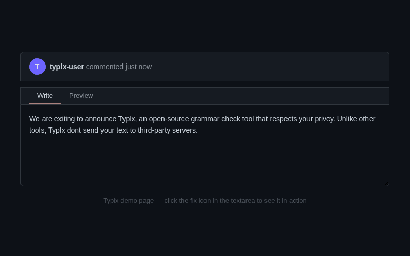

# Typlx

**The open-source, privacy-first grammar checker for your browser.**

[](LICENSE)
[](https://gitlab.varteq.com/typlix/chrome-grammar-fix-extension/-/pipelines)

Typlx fixes grammar and spelling in any text field on any website — powered by the LLM of your choice. Your text stays between you and your API provider. No third-party servers, no data harvesting, no accounts required.



## Why Typlx?

Most grammar checkers send every keystroke to a proprietary cloud. Typlx takes a different approach:

- **You own your data.** Text is sent only to the LLM provider you configure — no intermediary.
- **Bring your own model.** Use OpenAI, Anthropic Claude, or any OpenAI-compatible API (local models via Ollama, LM Studio, etc.).
- **Open source.** MIT licensed. Audit the code, fork it, contribute.
- **Works everywhere.** Textareas, inputs, contenteditable fields, SPAs, Gmail compose — if you can type in it, Typlx can fix it.

## Typlx vs. Alternatives

| Feature              | Typlx                   | Grammarly          | LanguageTool                       |
| -------------------- | ----------------------- | ------------------ | ---------------------------------- |
| Open source          | Yes (MIT)               | No                 | Partially                          |
| Privacy              | Your API key, your data | Cloud-processed    | Cloud-processed (self-host option) |
| Bring your own LLM   | Yes                     | No                 | No                                 |
| Local/offline models | Yes (via Ollama, etc.)  | No                 | Self-hosted server only            |
| Price                | Free + your API costs   | Free tier / $30/mo | Free tier / $5/mo                  |
| Chrome extension     | Yes (Manifest V3)       | Yes                | Yes                                |
| Per-site toggle      | Yes                     | Yes                | Yes                                |
| Token encryption     | AES-GCM at rest         | Proprietary        | N/A                                |

## Install

<!-- TODO: uncomment when published to Chrome Web Store -->
<!-- ### Chrome Web Store (recommended) -->
<!-- [Install Typlx](https://chrome.google.com/webstore/detail/typlx/EXTENSION_ID) from the Chrome Web Store. -->

### From Source

1. Clone the repo and install dependencies:

```bash
git clone https://gitlab.varteq.com/typlix/chrome-grammar-fix-extension.git
cd chrome-grammar-fix-extension
npm install --include=dev
```

2. Load in Chrome:
   - Navigate to `chrome://extensions`
   - Enable **Developer mode**
   - Click **Load unpacked** and select this project folder

3. Configure:
   - Click the Typlx icon in the toolbar
   - Select your LLM provider (OpenAI-compatible or Anthropic Claude)
   - Enter your API URL, model, and token
   - Click **Save Settings**

## Usage

1. Focus any text field on any page.
2. Click the fix icon in the field's bottom-right corner.
3. Wait for the correction (a spinner shows progress).
4. Done — your text is replaced with the corrected version.

Typlx works with `textarea`, `input[type="text" | "search" | "email" | "url"]`, and `contenteditable` elements. It handles dynamic/SPA pages automatically.

## Supported Providers

| Provider              | Endpoints Used                          |
| --------------------- | --------------------------------------- |
| **OpenAI-compatible** | `GET /models`, `POST /chat/completions` |
| **Anthropic Claude**  | Native Anthropic Messages API           |

Any API that implements the OpenAI chat completions interface works — including local model servers like Ollama, LM Studio, and vLLM.

## Security

- API tokens are **encrypted at rest** (AES-GCM with PBKDF2 key derivation) in `chrome.storage.local`.
- Tokens are only used in the background service worker — never exposed to content scripts or page context.
- No telemetry, no analytics, no phone-home behavior.

## Project Structure

```text
manifest.json
background/
  service-worker.js
  providers/
    anthropic-provider.js
    openai-provider.js
    provider-registry.js
content/
  content.js          # injected into pages (IIFE, shadow DOM)
  content-core.js     # testable pure functions
  content.css
popup/
  popup.html / popup.css / popup.js
utils/
  crypto.js           # AES-GCM token encryption
  storage.js          # Chrome storage wrapper
icons/
```

## Contributing

Contributions welcome. See [CONTRIBUTING.md](CONTRIBUTING.md) for setup, code quality tools (ESLint, Prettier, Vitest), and workflow.

## Documentation

- [User Guide](USERGUIDE.md)
- [Contributing Guide](CONTRIBUTING.md)
- [Release Notes](RELEASE_NOTES.md)

## License

MIT. See [LICENSE](LICENSE) for details.
